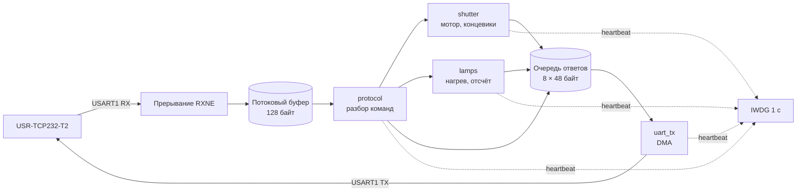

<div align="center">

# 🔥 FZK THERMO · Lamp & Shutter Controller

**Прошивка контроллера ламп нагрева и заслонки термографа**


[Что нового](#-что-нового-в-20) ·
[Исправленные ошибки](#-исправленные-ошибки) ·
[Протокол](#-протокол) ·
[Сборка](#%EF%B8%8F-сборка-и-прошивка) ·
[Железо](#-железо)

</div>

---

## ✨ Что нового в 2.0

Версия 2.0 — полная переработка прикладной части прошивки v1 (сборка 2025-10-10). Схема, пины и разводка **не менялись**. Проверено на железе 2026-10-06.

| | |
|---|---|
| 📨 **Надёжная связь** | ответы больше не теряются и не склеиваются, команды не портят друг друга |
| 🛑 **Точная остановка** | мотор встаёт на концевике за 10 мс вместо 320 мс перебега |
| 🛡️ **Безопасность** | при любой аварии мотор и лампы выключаются, сторожевой таймер ловит зависания |
| 🔍 **Диагностика** | `VERSION`, расширенный `STATUS`, сообщение `BOOT` с причиной перезагрузки, `SENSOR_FAULT` |
| 🧩 **Чистый код** | логика разнесена по модулям, все настройки в одном файле, статическая память |

---

## 🐞 Исправленные ошибки

<details open>
<summary><b>📨 Передача ответов</b></summary>

| Было | Стало |
|---|---|
| Все задачи писали в общий буфер `msg`, пока DMA его ещё отправлял. В линию уходила смесь двух сообщений | Очередь ответов (8 × 48 байт). Отдельная задача отправляет их строго по одному |
| При занятом DMA сообщение молча пропадало (`HAL_BUSY`), например второй ответ сразу после первого | Следующий ответ ждёт окончания предыдущего. Зависший DMA сбрасывается через 50 мс |
| `STATUS` терялся или портился, если совпадал с `COUNTD` | Ответы не пересекаются |

</details>

<details open>
<summary><b>📥 Приём команд</b></summary>

| Было | Стало |
|---|---|
| Гонка между прерыванием и задачей: вторая команда сразу за первой портила первую | Прерывание кладёт байты в потоковый буфер (128 байт), строку собирает задача |
| Буфер команды 10 символов | **32 символа** |
| Ветка переполнения недостижима, длинная команда превращалась в мусор | Длинная команда даёт `UNKNOWN_COMMAND;` |
| На неизвестную команду ответа не было, `LED;` без числа вызывал `atoi(NULL)` | `UNKNOWN_COMMAND;` на неизвестную команду, пропущенный или неверный аргумент |
| `\r` и `\n` от терминала ломали команду | Непечатные символы игнорируются |
| Префикс `I<n>` работал только слитно | Понимается и `I1LED 1;`, и `I1 LED 1;` |
| Перезапуск `HAL_UART_Receive_IT` в каждом прерывании, при ошибке UART приём замирал | Ошибки UART сбрасываются, приём не останавливается |
| `TIM` разбирался через `atoi` | Строгая проверка: только цифры, до 9 знаков. Верхнего предела нет, его задаёт ПО на ПК |

</details>

<details open>
<summary><b>⚙️ Мотор заслонки</b></summary>

| Было | Стало |
|---|---|
| Фильтр концевика «закрыто» 160 отсчётов: **≈320 мс езды** после срабатывания. У «открыто» фильтра не было | Оба концевика: 5 отсчётов × 2 мс = **10 мс**, затем мгновенный стоп |
| Входы концевиков без подтяжки, при обрыве провода читались случайно | Включены внутренние подтяжки |
| Оба концевика активны → считалось «открыто» | Неисправность: мотор стоит, `SENSOR_FAULT;`, движение запрещено |
| ШИМ в режиме PWM2: в коде «скорость 0» давала 100 % скважности | PWM1 + полярность LOW. Сигнал на PA8 прежний (драйвер инверсный), в коде 0 = стоп |
| ARR переписывался каждые 2 мс | ARR задаётся один раз, CCR пишется только при изменении скорости |
| Реверс на ходу менял направление сразу | Скорость сначала падает до 0, потом переключается направление |
| Таймаут сравнивал тики с миллисекундами | `pdMS_TO_TICKS`, работает при любой частоте тика |
| Мёртвая ветка торможения, `MOTOR_STOPPED` никогда не отправлялся | Удалено |

</details>

<details open>
<summary><b>💡 Лампы</b></summary>

| Было | Стало |
|---|---|
| Задача нагрева создавалась и убивалась (`osThreadTerminate`) прямо посреди отправки | Одна постоянная задача, команды через очередь |
| Результат `osThreadCreate` не проверялся. При нехватке памяти лампы больше не включались до перезагрузки | Всё создано статически, нехватки быть не может |
| `osDelay(1000)` копил ошибку отсчёта | Отсчёт от момента включения, без накопления ошибки |
| Подтверждение `FLASH 1;` собиралось и тут же затиралось | `FLASH 1;` отправляется |
| `FLASH 0` при выключенных лампах отвечал `FLASH_BUSY_OR_TIME_ZERO;` | `FLASH 0;` |

</details>

<details open>
<summary><b>🛡️ Защита и надёжность</b></summary>

| Было | Стало |
|---|---|
| `Error_Handler` и `HardFault` оставляли мотор и лампы включёнными | Безопасное состояние (мотор стоп, лампы и CW выкл), затем перезагрузка. Работает в `Error_Handler`, всех fault-обработчиках, `configASSERT`, при переполнении стека и нехватке памяти |
| Нет сторожевого таймера | **IWDG 1 с**. Сбрасывается, только если все задачи отметились за 800 мс. В отладке остановлен |
| Проверка стека выключена | `configCHECK_FOR_STACK_OVERFLOW 2`, `configUSE_MALLOC_FAILED_HOOK` |
| При старте выходы в неопределённом состоянии до инициализации | Безопасное состояние включается первым делом |

</details>

<details>
<summary><b>🧹 Чистка</b></summary>

- Удалены неиспользуемые буферы и переменные. Только `msg_local` и `msg_in` занимали около 640 байт из 12 КБ ОЗУ.
- Убрана повторная инициализация TIM1 и UART.
- `sprintf` и макросы со вшитой `;` заменены функциями.
- Имена `open` / `close` / `stop` больше не конфликтуют с POSIX.
- Приложение вынесено из `freertos.c` в отдельные модули.

</details>

---

## 📡 Протокол

USART1 **115200 8N1** → USR-TCP232-T2 → TCP. Каждая команда и каждый ответ заканчиваются `;`.
Пустая команда `;` (SYNC клиента после подключения) остаётся без ответа.

### Команды

| Команда | Ответ | |
|---|---|:---:|
| `LED 0;` / `LED 1;` | `LED n;` | 🆕 LED1 теперь работает |
| `SHUT 0;` | `SHUT_0 SHUT_OPENNING;` → `MOTOR_DONE_OPEN;` / `MOTOR_TIMEOUT;` | |
| `SHUT 1;` | `SHUT_1 SHUT_CLOSING;` → `MOTOR_DONE_CLOSE;` / `MOTOR_TIMEOUT;` | |
| `SHUT 2;` | `SHUT_2 SHUTTER_STOPPED;` (мгновенный стоп) | |
| `SHUT 0/1;` при неисправных концевиках | `SENSOR_FAULT;` | 🆕 |
| `TIM n;` | `TIM n;` | |
| `FLASH 1;` | `FLASH 1;` → `COUNTD n;` … `COUNTD 1;` → `FLASH 0;` | ✏️ |
| `FLASH 1;` (уже горят или время 0) | `FLASH_BUSY_OR_TIME_ZERO;` | |
| `FLASH 0;` (горят) | `FLASH_FORCEOFF;` | ✏️ было `IFLASH_FORCEOFF;` |
| `FLASH 0;` (не горят) | `FLASH 0;` | ✏️ |
| `STATUS;` | `STATUS <заслонка> LAMP <0/1> <осталось с>;` | ✏️ |
| `VERSION;` | `VERSION 2.0;` | 🆕 |
| неизвестная / длинная команда | `UNKNOWN_COMMAND;` | ✏️ |

🆕 новое · ✏️ изменено

### Состояние заслонки в `STATUS`

| | Значение | Когда |
|:---:|---|---|
| 🟢 | `OPENED` | на концевике «открыто» |
| 🔵 | `CLOSED` | на концевике «закрыто» |
| ⚪ | `BETWEEN` | стоит между концевиками |
| 🟡 | `OPENING` / `CLOSING` | едет |
| 🔴 | `FAULT` | оба концевика активны |

Пример: `STATUS BETWEEN LAMP 1 7;` — заслонка между концевиками, лампы горят, осталось 7 с.

### Сообщения, которые контроллер шлёт сам

| Сообщение | Когда |
|---|---|
| `BOOT <причина> VERSION 2.0;` | 🆕 после включения. Причина: `POWER`, `PIN`, `IWDG`, `SOFT`, `OTHER` |
| `SENSOR_FAULT;` | 🆕 оба концевика стали активны, мотор остановлен |
| `COUNTD n;` · `FLASH 0;` | во время и в конце нагрева |
| `MOTOR_DONE_OPEN;` · `MOTOR_DONE_CLOSE;` · `MOTOR_TIMEOUT;` | конец движения |

> [!WARNING]
> `BOOT IWDG` или `BOOT SOFT` означают, что контроллер перезагрузился сам после зависания или аварии.

---

## 🧩 Архитектура



| Файл | Назначение |
|---|---|
| `Core/Inc/app_config.h` | ⚙️ все настройки: версия, период, разгон, таймауты, размеры буферов |
| `Core/Src/app.c` | запуск, причина сброса, безопасное состояние, IWDG, хуки FreeRTOS |
| `Core/Src/uart_io.c` | приём в потоковый буфер, отправка через очередь и DMA |
| `Core/Src/protocol.c` | разбор команд и ответы |
| `Core/Src/shutter.c` | мотор заслонки и концевики |
| `Core/Src/lamps.c` | лампы и обратный отсчёт |
| `Core/Src/msg.c` | сборка ответов без `printf` |

Из CubeMX-файлов (`main.c`, `freertos.c`, `tim.c`, `stm32f3xx_it.c`, `FreeRTOSConfig.h`) старый прикладной код убран, правки только внутри блоков `USER CODE`.

---

## 🛠️ Сборка и прошивка

1. **STM32CubeIDE** → File → Import → *Existing Projects into Workspace* → папка проекта.
2. **Project → Clean**, затем **Build**.
3. **Run As → STM32 C/C++ Application**.

> [!NOTE]
> Файл `.ioc` не менялся. Повторная генерация кода в CubeMX правки не сотрёт, но без необходимости её лучше не запускать.

<details>
<summary><b>↩️ Откат на v1</b></summary>

Дамп флеш-памяти исходной прошивки лежит в `backup/`:

```
STM32_Programmer_CLI -c port=SWD -w backup\FZK_dump_2026-10-06.bin 0x08000000 -v -rst
```

</details>

---

## 🔌 Железо

| Сигнал | Пин | Примечание |
|---|---|---|
| ШИМ мотора | `PA8` | TIM1 CH1, 16 кГц, инверсный драйвер: высокий уровень = стоп |
| Направление | `PA7` | MOTOR_CW |
| Лампа 1 / 2 | `PA12` / `PA11` | |
| Концевик «открыто» | `PB5` | активный низкий, внутренняя подтяжка |
| Концевик «закрыто» | `PB6` | активный низкий, внутренняя подтяжка |
| LED1 | `PB3` | |
| UART к T2 | `PA9` TX / `PA10` RX | TTL 3,3 В |

MCU **STM32F303K8** (NUCLEO-F303K8), HSI 16 МГц, 64 КБ флеш, 12 КБ ОЗУ.
